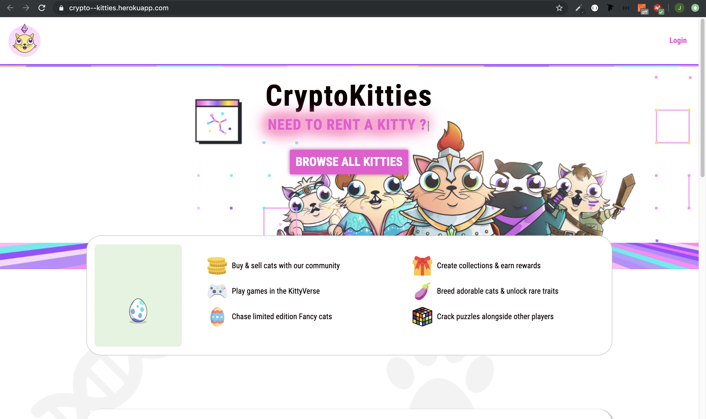

  Project where we are reproducing the CryptoKitties website with the MVC model of the app AirBnb (renting Kitties instead of buying just).

  Here is the CryptoKitties website : https://www.cryptokitties.co/catalogue .

  Add here a small descritpion about the CryptoKitties porject : 
  
  I worked 5 days on this project the main aim was to adapt the user journey of  AirBnb with CryptoKitties design. Like you were able to rent kitties (not buy) and also generate a new one.
  
  Screenshot of the home page : 
  
  
  
